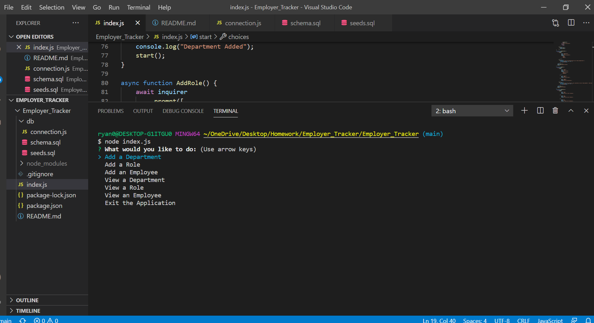
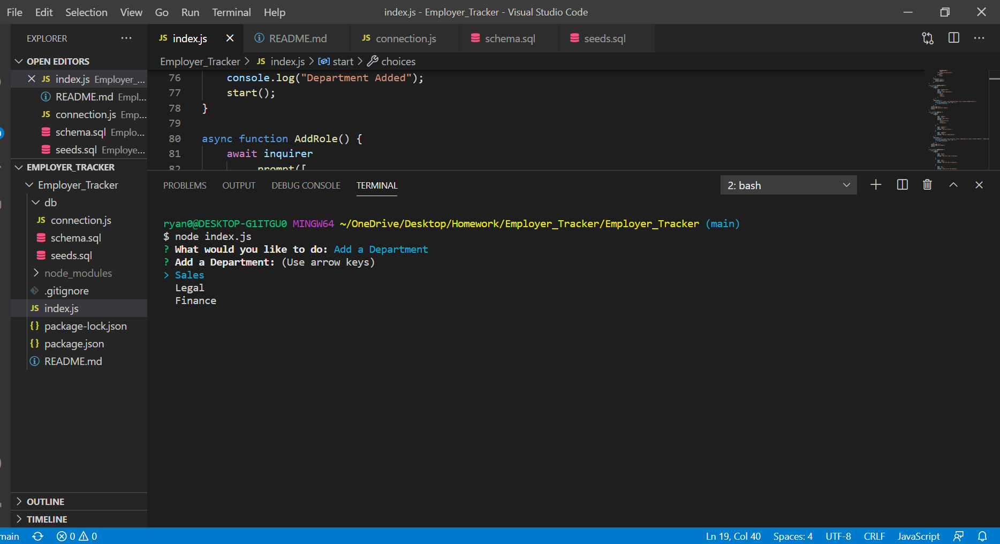

## Ryan's Company Employer Tracker

Managed your teams and company efficiently with this new app!

## Description

Need help with keeping up to date with all the employees in your large company? This new app is created to help guide you through key prompts to help identify any individual in the company! In a large company new employees are always starting. Also working remote these days it's important to be able to communicate with the proper people and channels in your company.

## Installation

What are the steps required to install your project? Clone a copy of this repository from Github to get started!

## Features

An easy user experience that is intuitive and stylish! This application will be continually updated.

## Tests

This has been tested on W3C markup validator and no errors or warnings to show.

## ScreenShot

## Credits

Ryan Anderson
